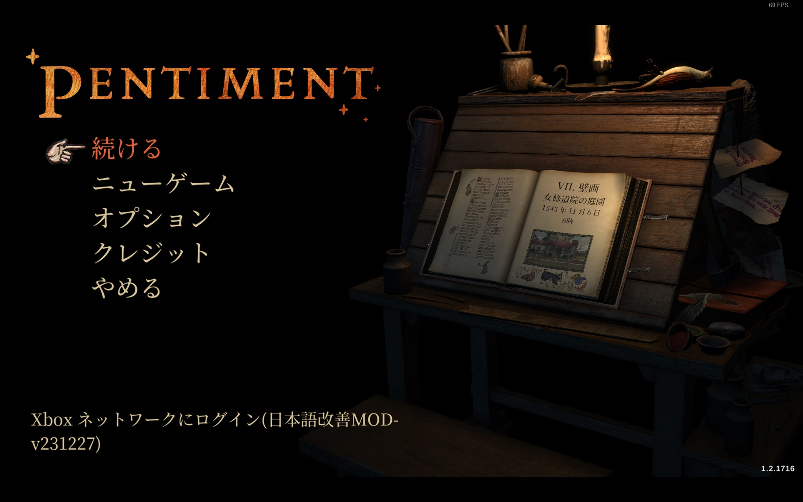

Pentimentの日本語翻訳を改善するMODです。といっても、ただのテキストファイルです。

[Pentiment-betterJP.zip](https://github.com/youkoseki/pentiment-betterjp/raw/main/Pentiment-betterJP.zip)をダウンロード、解凍して、出てきたmodsフォルダーごと、

ユーザーフォルダー（\\ユーザー\(自分のアカウント)\）以下の、

\AppData\LocalLow\Obsidian Entertainment\Pentiment\

の直下に置いてください。ゲームのプログラムのあるフォルダーではありません！

タイトル画面で「(MOD-vなんとか)」と表示されたら成功です。

出来る限り、[表記揺れ](https://github.com/youkoseki/pentiment-betterjp/blob/main/tools/2-machinecorrect.py)も統一させています。